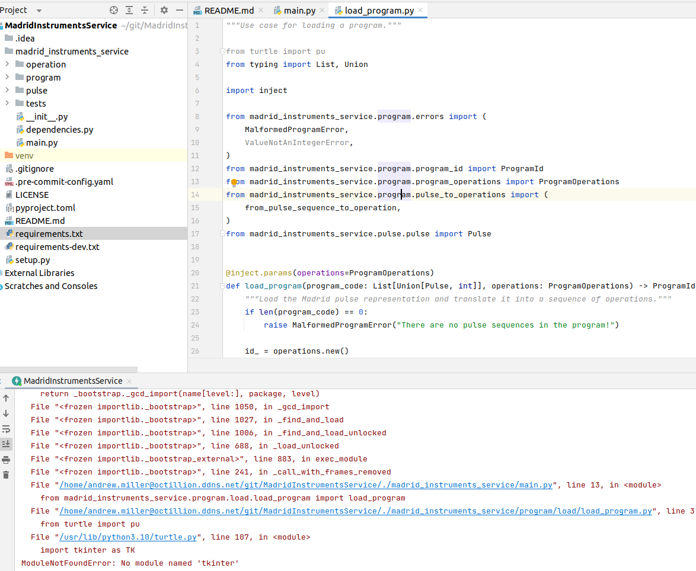

# How to install
1. Ensure you are running Python 3.10
2. Optional: create a virtual environment (conda env, etc)
3. Install dependencies: `pip install -r requirements.txt`
4. Install dev dependencies: `pip install -r requirements-dev.txt`
5. Run tests: `pytest`
6. Update `.env` file in the project root with URL to Acme and Madrid instrument service endpoints for your system
7. Start up Fast API: `python -m uvicorn app.main:app --reload --host 0.0.0.0 --port 7070`
8. Navigate to http://localhost:7070/docs
9. Open POST /program
10. Click **Try it out** button
11. Paste your request
12. Press **Execute**
13. Alternatively, you may try curl
```
curl -X 'POST' \
  'http://localhost:7070/program' \
  -H 'accept: application/json' \
  -H 'Content-Type: application/json' \
  -d '{
    "id": "",
    "initial_value": 10,
    "control_instrument": "Acme",
    "operations": [
        {
            "type": "Sum",
            "value": 120
        },
        {
            "type": "Mul",
            "value": 3
        },
        {
            "type": "Div",
            "value": 2
        }
    ]
}'
```

# Findings
* Values are integers (including negative) 
  * Confirmed with requests to Acme and Madrid services
  * Confirmed by code inspection in Acme and Madrid services repositories
* Paths to load and run endpoints are not the same between Acme and Madrid
  * Confirmed by inspecting OpenAPI documentation for these services
* Madrid Service was not runnable on my system without changes
  * I had to optimize imports to fix it
  * Please see below 

# Design decisions
* Used Abstract Base Classes (ABCs) in order to support extending system to other types of instruments
* Used a generic Rest API instrument service client as both existing clients follow the same format
  * If new formats are needed, then another implementation can be developed based on ABC
* Used a generic pulse generation method but still allowed for flexibility to provide custom translators via ABCs
* Exposed functionality via Fast API
  * This is just what people use these days including myself in my current job
* Used a mapping for being able to expand instruction sets
* Went minimal on error handling and validation as instructed
* Assumed that programs will always be simple sets of instructions
  * Reality is harsher though and this is obviously an oversimplification
